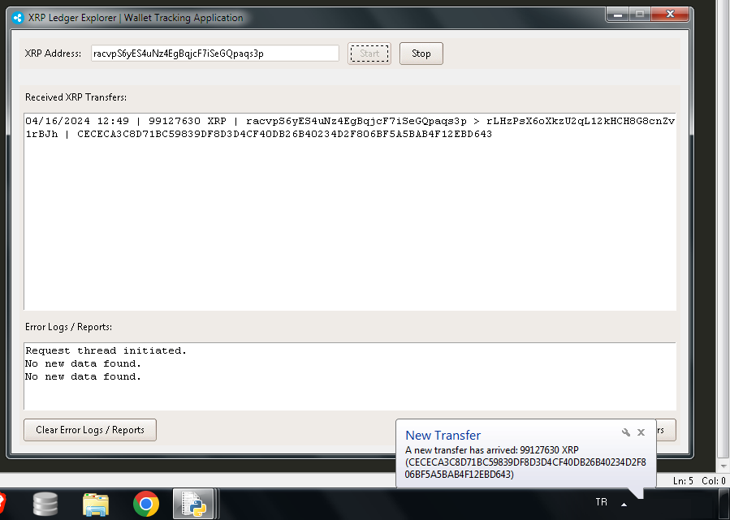

# XRP Ledger Explorer | Wallet Tracking Application

Bu uygulama, XRP Ledger'daki bir cüzdanın transfer işlemlerini izlemek için kullanılır. Kullanıcı, XRP adresini girer ve uygulama belirli aralıklarla cüzdanındaki son transferleri kontrol eder. Yeni bir transfer algılandığında, bu bilgiyi ekranda gösterir ve bir bildirim gönderir.

## Features | Özellikler

- XRP cüzdanının transferlerini izleme
- Yeni transferlerde bildirim alma
- Kullanıcı dostu arayüz

## How to Use | Nasıl Kullanılır

1. Uygulamayı başlatmak için `start` butonuna tıklayın.
2. XRP adresinizi giriş alanına yazın.
3. Uygulama, belirli aralıklarla cüzdanınızdaki son transferleri kontrol edecek ve yeni bir transfer algılandığında size bildirim gönderecektir.

## Dependencies | Bağımlılıklar

- Python 3.x
- Tkinter
- ttkthemes
- requests
- plyer

## Screenshots | Ekran Görüntüleri

## License | Lisans

Bu proje MIT lisansı altında lisanslanmıştır. Daha fazla bilgi için [LICENSE](LICENSE) dosyasına göz atabilirsiniz.

